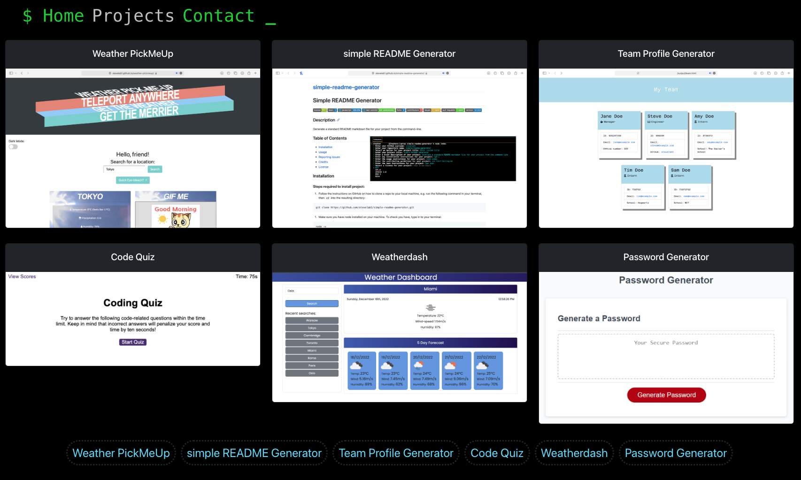

# Dev Portfolio

 

## Description

Frontend web development portfolio using React, React Router and Bootstrap.

## Deployed:

https://stevelab1.github.io/dev-portfolio

## Screenshot

## Reporting issues

### Suggesting features, improvements, bug fixes

https://github.com/stevelab1/dev-portfolio/issues

## Credits

- Meta
- Trilogy

## License

License pending
